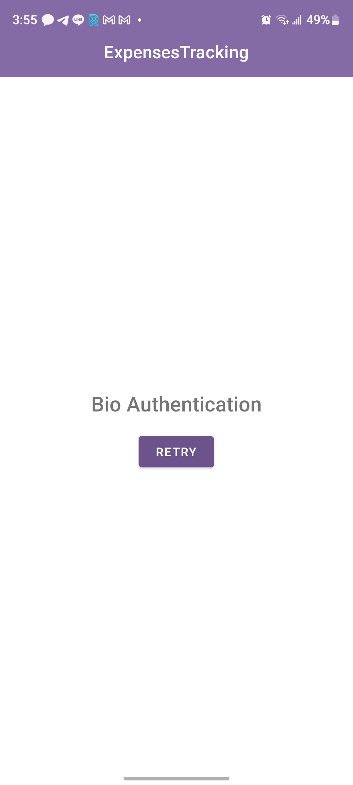
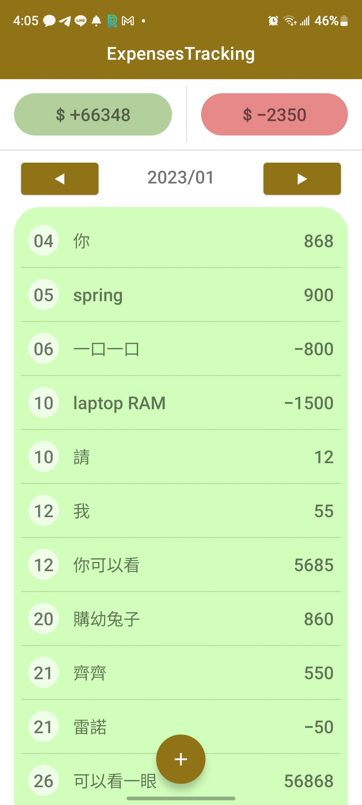

# ExpensesTracking 記帳APP
### 國立台北教育大學 110學年度 嵌入式系統軟體設計 期末專題

* 目的與優點  
是簡單介面、操作容易的記帳APP，  
加上目前手機都配備生物辨識功能，新增了需要經過生物辨識才能進到APP裡的門檻，  
又為使用者加上一級安全性。

* 操作說明  
<table>
  <tr>
    <td></td>
    <td></td>
    <td></td>
    <td></td>
  </tr>
  <tr>
    <td align="center">˙ 初始畫面</td>
    <td align="center">取消辨識可以重試</td>
    <td align="center">辨識成功進入主業</td>
    <td align="center">新增項目<br>(正負分別代表收入和支出)</td>
  </tr>
  <tr>
    <td></td>
    <td></td>
    <td></td>
  </tr>
  <tr>
    <td align="center">DatePicker</td>
    <td align="center">欄位不可為空白</td>
    <td align="center">點擊項目可以刪除</td>
  </tr>
</table>

* 主題會跟隨系統更新  
<table>
  <tr>
    <td></td>
    <td></td>
    <td></td>
    <td></td>
  </tr>
</table>

* SQLite  
```
ExpensesData  ────  expenses(收支資料) ─┬── _id
                                       ├── yyyymm(項目年月)
                                       ├── date(日)
                                       ├── detail(項目明細)
                                       └── money(收入or支出)
```
